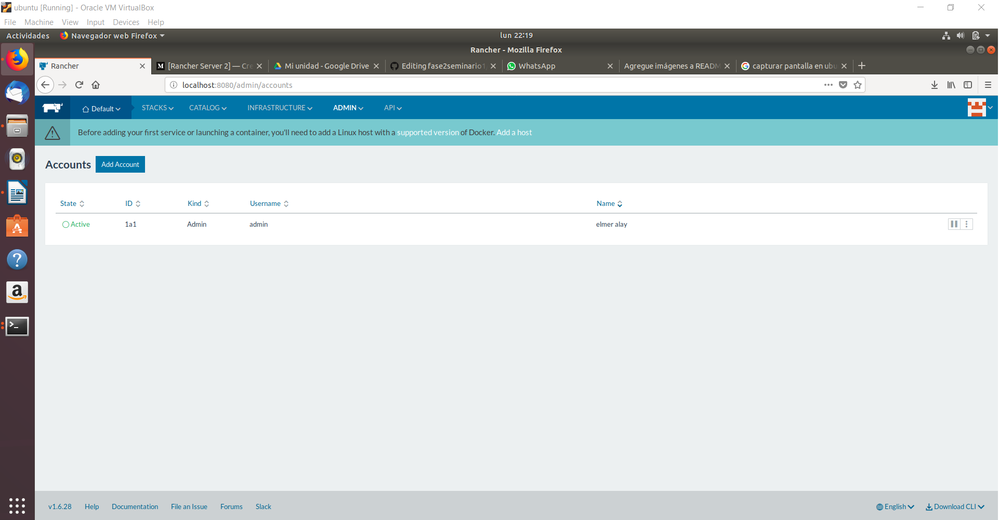
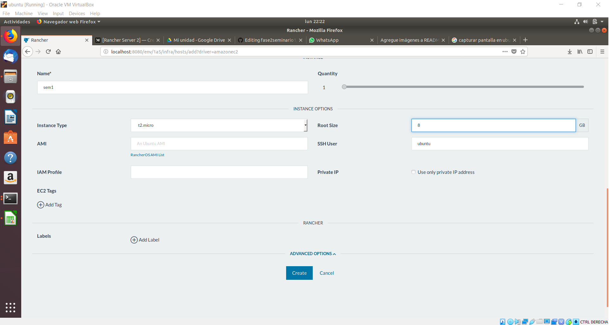
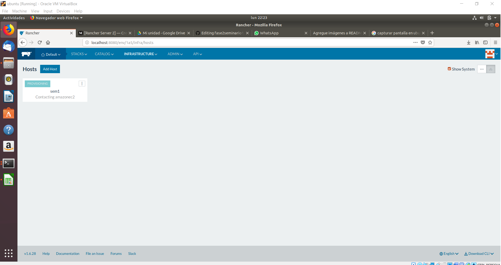

# DESARROLLADORES
UNIVERSIDAD DE SAN CARLOS DE GUATEMALA

FACULTAD DE INGENIERIA

SEMINARIO DE SISTEMAS 1

BAYRON ROMEO AXPUAC YOC 201314474

WILSON GUERRA 201314571

ELMER EDGARDO ALAY YUPE 201212945 

# FASE 2
Se establece un sistema de E-Commerce, el sistema esta montado en la nube.  La palabra ecommerce es una abreviatura de comercio electrónico que, básicamente, designa el comercio que se realiza online. Este tipo de negocio ha ganado fuerza en los últimos años, cuando los consumidores se dieron cuenta de que Internet es un entorno seguro para la compra. Nuestro sistema cuenta con un servidor web el cual nos permite visualizar los productos de una empresa y así mismo ingresar nuevos productos al sistema toda esta información es almacenada en una base de datos. Esta aplicación se llevo a cabo gracias diversas herramientas tales como DockerCompose, Terraform o cloud formation, Rancher. 

# DOCKER COMPOSE
Compose es una herramienta para definir y ejecutar aplicaciones Docker de múltiples contenedores. Docker Compose es una herramienta que permite simplificar el uso de Docker, generando scripts que facilitan el diseño y la construcción de servicios. Con Docker Compose se puede crear diferentes contenedores y al mismo tiempo, en cada contenedor, diferentes servicios.En vez de utilizar una serie de comandos bash y scripts, Docker Compose implementa recetas similares a las de Ansible, para poder instruir al engine a realizar tareas, programaticamente. 

¿Cómo instalarlo en un S.O Linux?
Sencillo primero ingresamos el siguiente comando en nuestra terminal:
                
     sudo curl -L https://github.com/docker/compose/releases/download/1.17.0/docker-compose-`uname -s`-`uname -m` -o /usr/local/bin/docker-compose
      
Luego le damos permisos de ejecución:

    sudo chmod +x /usr/local/bin/docker-compose
    
El siguiente comando te permitirá que todo está instalado correctamente.

    docker-compose --version
    docker-compose version 1.17.0, build 1719ceb
    
---- instalacin de una servidor apache con php con docker compose --
1) Crearmoes una carpeta con el nombre Pagina

        mkdir Pagina
         
      
2) Ingresaremos a la carpeta creada y creamos un archivo llamado index.php

        cd Pagina
        nano index.php

3) Creamos un documento dockerfiel
    
      
        nano dockerfile
4) Dentro del documento dockerfile agregaremos el siguiente contenido.

        FROM php:7.0-apache
        COPY . /home/ubuntu/Pagina
        WORKDIR /home/ubuntu/Pagina
        
5) Ya con el dockerfile encontrado procederemos la imagen a utilizar dentro de nuestro sistema.

        sudo docker build -t servidor2 .
        
6) Ahora crearemos un archivo .yml con el nombre de docker-compose

       nano docker-compose.yml
       
7)Agregamos el contenido siguiente al archivo creado con anterioridad.

    # ./docker-compose.yml

    version: '3.3'
    services:
    apache:
      image: servidor2
      ports:
      - '80:80'
    volumes:
      - ~/Pagina:/var/www/html

8) y creamos en contenedor por medio del comando.

        sudo docker-compose up -d   
        
        
---- instalacin de una base de datos-
1) Crearmoes una carpeta con el nombre BaseDeDatos y una llamada sql-scripts

        mkdir BasesDeDatos
        mkdir sql-scripts
        
         
      
2) Ingresaremos a la carpeta creada y creamos un archivo llamado tablas.sql con el siguiente contenido

        CREATE TABLE PRODUCTO(
        id MEDIUMINT NOT NULL AUTO_INCREMENT,
        nombre CHAR(30) NOT NULL,
        precio INT NOT NULL,
        cantidad INT NOT NULL,
        PRIMARY KEY (id)
        );

3) Creamos un documento dockerfiel
    
      
        nano dockerfile
4) Dentro del documento dockerfile agregaremos el siguiente contenido.

        FROM mysql:5.7
        ENV MYSQL_DATABASE PROYECTOSEMINARIO1
        COPY ./sql-scripts/ /docker-entrypoint-initdb.d/
        
5) Ya con el dockerfile encontrado procederemos la imagen a utilizar dentro de nuestro sistema.

        docker build -t basef2 .
        
6) Ahora crearemos un archivo .yml con el nombre de docker-compose

       nano docker-compose.yml
       
7)Agregamos el contenido siguiente al archivo creado con anterioridad.

    version: '3.3'
    services:
    db:
    image: basef2
    restart: always
    environment:
      MYSQL_DATABASE: 'db'
      MYSQL_USER: 'user'
      MYSQL_PASSWORD: '123456789'
      MYSQL_ROOT_PASSWORD: '123456789'
    ports:
      - '3306:3306'
    expose:
      - '3306'
    volumes:
      - my-db:/var/lib/mysql
    volumes:
      my-db:

8) y creamos en contenedor por medio del comando.

        sudo docker-compose up -d          
        

# TERRAFORM
Cuanto más grande se vuelve un servicio, más complicado se hace la administración y la operación del mismo de manera manual. La solución a todos estos problemas pasaría por disponer de una herramienta que nos permita modelar nuestra infraestructura como código, pero que sea agnóstica al entorno cloud donde se ejecute.
Terraform es un software de infraestructura como código desarrollado por HashiCorp. Permite a los usuarios definir y configurar la infraestructura de un centro de datos en un lenguaje de alto nivel, generando un plan de ejecución para desplegar la infraestructura en OpenStack. HashiCorp Terraform permite crear, cambiar y mejorar la infraestructura de manera predecible y segura. Es una herramienta de código abierto que codifica las API en archivos de configuración declarativos que pueden compartirse entre los miembros del equipo, tratarse como código, editarse, revisarse y versionarse.

# RANCHER
RancherOS es un pequeño sistema operativo que está específicamente orientado a trabajar con el popular Docker, de hecho, el sistema operativo ocupa tan solo 20MB debido a que tiene únicamente lo básico para ejecutar Docker e incorporarle una gran cantidad de funcionalidades. Todo en RancherOS es gestionado por Docker, tanto los servicios del sistema, como udev como rsyslog. Por tanto, RancherOS es simplemente la base para posteriormente ejecutar cualquier software a través de Docker, todo en RancherOS se ejecuta en estos contenedores. RancherOS es la forma más pequeña y fácil de ejecutar Docker en producción. Cada proceso en RancherOS es un contenedor administrado por Docker. Esto incluye servicios del sistema como udevy syslog. Como solo incluye los servicios necesarios para ejecutar Docker, RancherOS es significativamente más pequeño que la mayoría de los sistemas operativos tradicionales. Al eliminar bibliotecas y servicios innecesarios, también se reducen los requisitos de parches de seguridad y otros tipos de mantenimiento. Esto es posible porque, con Docker, los usuarios normalmente empaquetan todas las bibliotecas necesarias en sus contenedores. Otra forma en la que RancherOS está diseñado específicamente para ejecutar Docker es que siempre ejecuta la última versión de Docker. Esto permite a los usuarios aprovechar las últimas capacidades y correcciones de errores de Docker.

RancherOS incluye la cantidad mínima de software necesaria para ejecutar Docker. Todo lo demás se puede extraer dinámicamente a través de Docker. RancherOS simplifica la ejecución de contenedores a escala en desarrollo, prueba y producción.

## Instalar Rancher
1)  Comenzamos instalando docker en nuestra máquina con ubuntu
                    
        sudo apt install docker.io 
2) Ahora procedemos a instalar rancher con el siguiente comando
      
        sudo docker run -d --restart=unless-stopped -p 8080:8080 rancher/server:stable
3) Para acceder sólo tenemos que ir a nuestro navegador y colocar

        http://TU-IP-PUBLICA:8080
4) Procedemos a crear un acceso

5) Ahora Creamos un host
6) Seleccionaremos la opción de amazon

7) Ingresamos los datos de nuestro access key
8) Continuamos y nos mandará a la siguiente ventana

9) En ella colocamos lo que nos solicita

10) Damos click en crear 
11) Empezará a cargar

